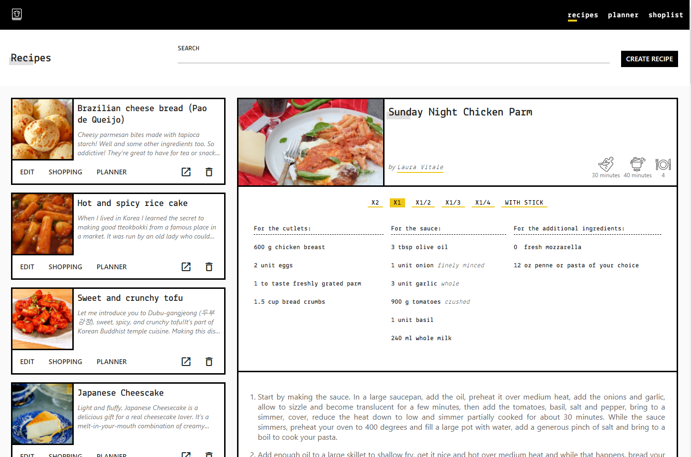
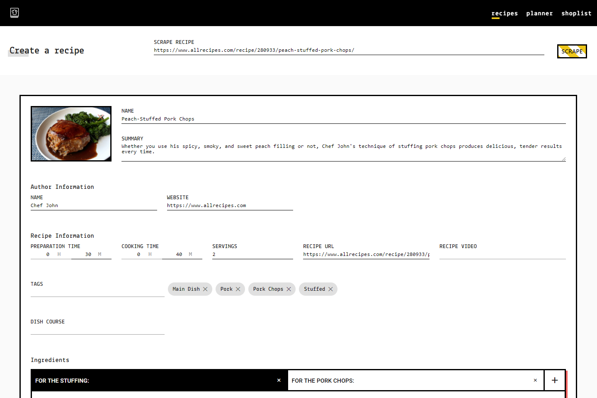
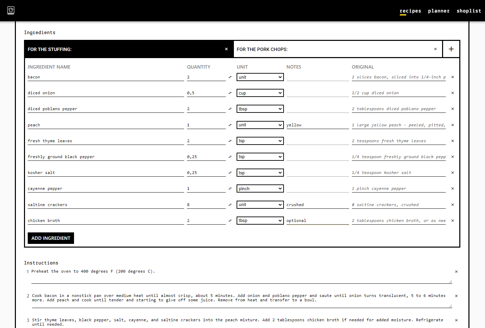
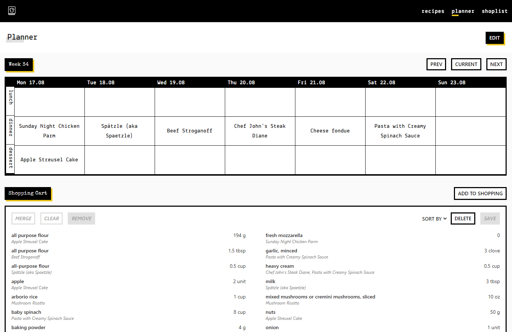

#  Kitchen
Kitchen is my personal online recipe box. I was tired of having all my favourite recipes all over the place, so I created a multi platform tool to organize them.

The app also includes a planner/calendar to organize my shopping cart. In the future I will try to sync this data with my supermarket's cart.

You can check a live demo [here](https://recipes.inama.dev)

### Screenshots

